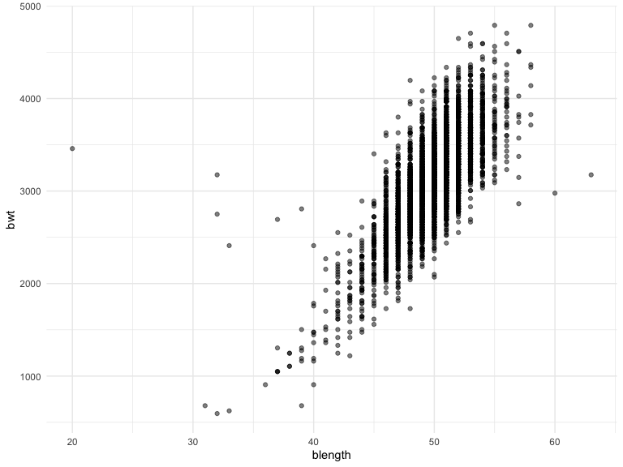
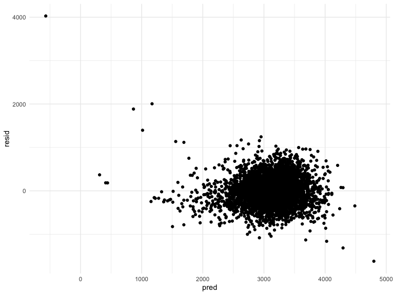
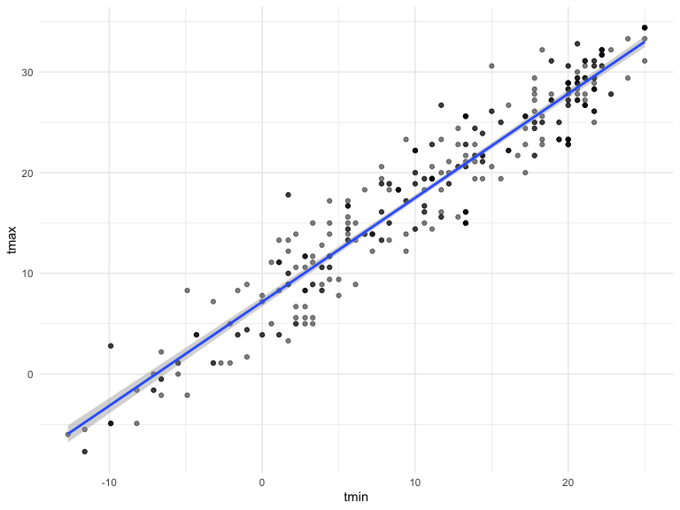
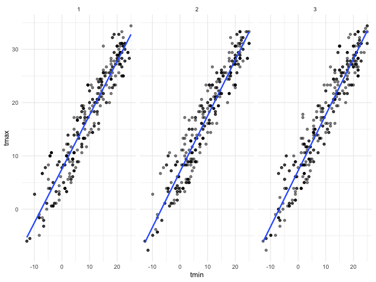

Homework 6
================
Michelle Lui
2020-12-09

``` r
library(tidyverse)
library(modelr)
library(p8105.datasets)
library(mgcv)
```

    ## Loading required package: nlme

    ## 
    ## Attaching package: 'nlme'

    ## The following object is masked from 'package:dplyr':
    ## 
    ##     collapse

    ## This is mgcv 1.8-33. For overview type 'help("mgcv-package")'.

### Problem 1

``` r
homicide_df = 
  read_csv("data/homicide-data.csv", na = c("", "NA", "Unknown")) %>% 
  mutate(
    city_state = str_c(city, state, sep = ", "),
    victim_age = as.numeric(victim_age),
    resolution = case_when(
      disposition == "Closed without arrest" ~ 0,
      disposition == "Open/No arrest"        ~ 0,
      disposition == "Closed by arrest"      ~ 1)
  ) %>% 
  filter(
    victim_race %in% c("White", "Black"),
    city_state != "Tulsa, AL") %>% 
  select(city_state, resolution, victim_age, victim_race, victim_sex)
```

    ## Parsed with column specification:
    ## cols(
    ##   uid = col_character(),
    ##   reported_date = col_double(),
    ##   victim_last = col_character(),
    ##   victim_first = col_character(),
    ##   victim_race = col_character(),
    ##   victim_age = col_double(),
    ##   victim_sex = col_character(),
    ##   city = col_character(),
    ##   state = col_character(),
    ##   lat = col_double(),
    ##   lon = col_double(),
    ##   disposition = col_character()
    ## )

One city

``` r
baltimore_df =
  homicide_df %>% 
  filter(city_state == "Baltimore, MD")
glm(resolution ~ victim_age + victim_race + victim_sex, 
    data = baltimore_df,
    family = binomial()) %>% 
  broom::tidy() %>% 
  mutate(
    OR = exp(estimate),
    CI_lower = exp(estimate - 1.96 * std.error),
    CI_upper = exp(estimate + 1.96 * std.error)
  ) %>% 
  select(term, OR, starts_with("CI")) %>% 
  knitr::kable(digits = 3)
```

| term              |    OR | CI\_lower | CI\_upper |
| :---------------- | ----: | --------: | --------: |
| (Intercept)       | 1.363 |     0.975 |     1.907 |
| victim\_age       | 0.993 |     0.987 |     1.000 |
| victim\_raceWhite | 2.320 |     1.648 |     3.268 |
| victim\_sexMale   | 0.426 |     0.325 |     0.558 |

Across cities

``` r
models_results_df = 
  homicide_df %>% 
  nest(data = -city_state) %>% 
  mutate(
    models = 
      map(.x = data, ~glm(resolution ~ victim_age + victim_race + victim_sex, data = .x, family = binomial())),
    results = map(models, broom::tidy)
  ) %>% 
  select(city_state, results) %>% 
  unnest(results) %>% 
  mutate(
    OR = exp(estimate),
    CI_lower = exp(estimate - 1.96 * std.error),
    CI_upper = exp(estimate + 1.96 * std.error)
  ) %>% 
  select(city_state, term, OR, starts_with("CI"))
```

``` r
models_results_df %>% 
  filter(term == "victim_sexMale") %>% 
  mutate(city_state = fct_reorder(city_state, OR)) %>% 
  ggplot(aes(x = city_state, y = OR)) + 
  geom_point() + 
  geom_errorbar(aes(ymin = CI_lower, ymax = CI_upper)) + 
  theme(axis.text.x = element_text(angle = 90, hjust = 1))
```


### Problem 2

``` r
baby_df = 
  read_csv("./data/birthweight.csv") %>%
  mutate(
    babysex = as.factor(babysex),
    frace = as.factor(frace),
    malform = as.factor(malform),
    mrace = as.factor(mrace)
  ) %>%
  na.omit()
```

    ## Parsed with column specification:
    ## cols(
    ##   .default = col_double()
    ## )

    ## See spec(...) for full column specifications.

create proposed model

``` r
my_mod = lm(bwt ~ blength + gaweeks, data = baby_df)
baby_df %>%
  add_predictions(my_mod) %>%
  add_residuals(my_mod) %>%
  ggplot(aes(x = pred, y = resid)) + geom_point()
```



cross validation for two comparison models

``` r
cv_df = crossv_mc(baby_df, 100)
cv_df = 
  cv_df  %>%
  mutate(
    twovar_mod = map(train, ~lm(bwt ~ blength + gaweeks, data = .x)),
    threevar_mod = map(train, ~lm(bwt ~ bhead * blength * babysex, data = .x))) %>%
  mutate(
    rmse_twovar = map2_dbl(twovar_mod, test, ~rmse(model = .x, data = .y)),
    rmse_threevar = map2_dbl(threevar_mod, test, ~rmse(model = .x, data = .y)))
```

plot prediction error distribution

``` r
cv_df %>% 
  select(starts_with("rmse")) %>% 
  pivot_longer(
    everything(),
    names_to = "model", 
    values_to = "rmse",
    names_prefix = "rmse_") %>% 
  mutate(model = fct_inorder(model)) %>% 
  ggplot(aes(x = model, y = rmse)) + geom_violin()
```



### Problem 3

``` r
weather_df = 
  rnoaa::meteo_pull_monitors(
    c("USW00094728"),
    var = c("PRCP", "TMIN", "TMAX"), 
    date_min = "2017-01-01",
    date_max = "2017-12-31") %>%
  mutate(
    name = recode(id, USW00094728 = "CentralPark_NY"),
    tmin = tmin / 10,
    tmax = tmax / 10) %>%
  select(name, id, everything())
```

    ## Registered S3 method overwritten by 'hoardr':
    ##   method           from
    ##   print.cache_info httr

    ## using cached file: /Users/michellelui/Library/Caches/R/noaa_ghcnd/USW00094728.dly

    ## date created (size, mb): 2020-12-09 14:13:10 (7.536)

    ## file min/max dates: 1869-01-01 / 2020-12-31

``` r
lm(tmax ~ tmin, data = weather_df) %>%
  broom::tidy() %>%
  knitr::kable(digits = 3)
```

| term        | estimate | std.error | statistic | p.value |
| :---------- | -------: | --------: | --------: | ------: |
| (Intercept) |    7.209 |     0.226 |    31.847 |       0 |
| tmin        |    1.039 |     0.017 |    61.161 |       0 |

``` r
lm(tmax ~ tmin, data = weather_df) %>%
  broom::glance() %>%
  knitr::kable(digits = 3)
```

| r.squared | adj.r.squared | sigma | statistic | p.value | df |    logLik |      AIC |      BIC | deviance | df.residual | nobs |
| --------: | ------------: | ----: | --------: | ------: | -: | --------: | -------: | -------: | -------: | ----------: | ---: |
|     0.912 |         0.911 | 2.938 |  3740.663 |       0 |  1 | \-910.286 | 1826.572 | 1838.272 | 3133.449 |         363 |  365 |

``` r
boot_sample = function(df) {
  sample_frac(df, replace = TRUE)
}

boot_sample(weather_df) %>%
  ggplot(aes(x = tmin, y = tmax)) + 
  geom_point(alpha = .5) +
  stat_smooth(method = "lm")
```

    ## `geom_smooth()` using formula 'y ~ x'



``` r
boot_straps = 
  data_frame(
    strap_number = 1:50,
    strap_sample = rerun(50, boot_sample(weather_df))
  )

boot_straps %>% 
  filter(strap_number %in% 1:2) %>% 
  mutate(strap_sample = map(strap_sample, ~arrange(.x, tmin))) %>% 
  pull(strap_sample)
```

    ## [[1]]
    ## # A tibble: 365 x 6
    ##    name           id          date        prcp  tmax  tmin
    ##    <chr>          <chr>       <date>     <dbl> <dbl> <dbl>
    ##  1 CentralPark_NY USW00094728 2017-12-31     0  -6   -12.7
    ##  2 CentralPark_NY USW00094728 2017-12-31     0  -6   -12.7
    ##  3 CentralPark_NY USW00094728 2017-12-29     0  -5.5 -11.6
    ##  4 CentralPark_NY USW00094728 2017-12-29     0  -5.5 -11.6
    ##  5 CentralPark_NY USW00094728 2017-03-05     0   2.8  -9.9
    ##  6 CentralPark_NY USW00094728 2017-03-05     0   2.8  -9.9
    ##  7 CentralPark_NY USW00094728 2017-03-11     0  -1.6  -8.2
    ##  8 CentralPark_NY USW00094728 2017-03-11     0  -1.6  -8.2
    ##  9 CentralPark_NY USW00094728 2017-03-11     0  -1.6  -8.2
    ## 10 CentralPark_NY USW00094728 2017-12-30    13  -4.9  -8.2
    ## # … with 355 more rows
    ## 
    ## [[2]]
    ## # A tibble: 365 x 6
    ##    name           id          date        prcp  tmax  tmin
    ##    <chr>          <chr>       <date>     <dbl> <dbl> <dbl>
    ##  1 CentralPark_NY USW00094728 2017-12-31     0  -6   -12.7
    ##  2 CentralPark_NY USW00094728 2017-12-31     0  -6   -12.7
    ##  3 CentralPark_NY USW00094728 2017-12-28     0  -7.7 -11.6
    ##  4 CentralPark_NY USW00094728 2017-12-28     0  -7.7 -11.6
    ##  5 CentralPark_NY USW00094728 2017-01-09     0  -4.9  -9.9
    ##  6 CentralPark_NY USW00094728 2017-01-09     0  -4.9  -9.9
    ##  7 CentralPark_NY USW00094728 2017-03-05     0   2.8  -9.9
    ##  8 CentralPark_NY USW00094728 2017-01-08     0  -3.8  -8.8
    ##  9 CentralPark_NY USW00094728 2017-12-27     0  -4.3  -8.2
    ## 10 CentralPark_NY USW00094728 2017-03-11     0  -1.6  -8.2
    ## # … with 355 more rows

``` r
boot_straps %>% 
  filter(strap_number %in% 1:3) %>% 
  unnest(strap_sample) %>% 
  ggplot(aes(x = tmin, y = tmax)) + 
  geom_point(alpha = .5) +
  stat_smooth(method = "lm", se = FALSE) +
  facet_grid(~strap_number) 
```

    ## `geom_smooth()` using formula 'y ~ x'


for r squared

``` r
bootstrap_results = 
  boot_straps %>% 
  mutate(
    models = map(strap_sample, ~lm(tmax ~ tmin, data = .x) ),
    results = map(models, broom::glance)) %>% 
  select(-strap_sample, -models) %>% 
  unnest(results) 

bootstrap_results %>%
  ggplot(aes(x = r.squared)) +
  geom_density()
```


``` r
bootstrap_results %>%
  summarize(
    ci_lower = quantile(r.squared, 0.025),
    ci_upper = quantile(r.squared, 0.975))
```

    ## # A tibble: 1 x 2
    ##   ci_lower ci_upper
    ##      <dbl>    <dbl>
    ## 1    0.896    0.926

for log(beta0 \* beta1)

``` r
bootstrap_results = 
  boot_straps %>% 
  mutate(
    models = map(strap_sample, ~lm(tmax ~ tmin, data = .x) ),
    results = map(models, broom::tidy)) %>% 
  select(-strap_sample, -models) %>% 
  unnest(results) %>%
  select(strap_number, term, estimate) %>%
  pivot_wider(
    names_from = "term",
    values_from = "estimate"
  )

bootstrap_results =
tibble(
bootstrap_results,
log = log(pull(bootstrap_results, '(Intercept)') * pull(bootstrap_results, tmin)))

bootstrap_results %>%
  ggplot(aes(x = log)) +
  geom_density()
```


``` r
bootstrap_results %>%
  summarize(
    ci_lower = quantile(log, 0.025),
    ci_upper = quantile(log, 0.975))
```

    ## # A tibble: 1 x 2
    ##   ci_lower ci_upper
    ##      <dbl>    <dbl>
    ## 1     1.99     2.06
