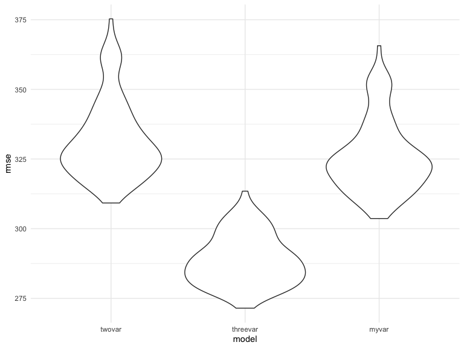
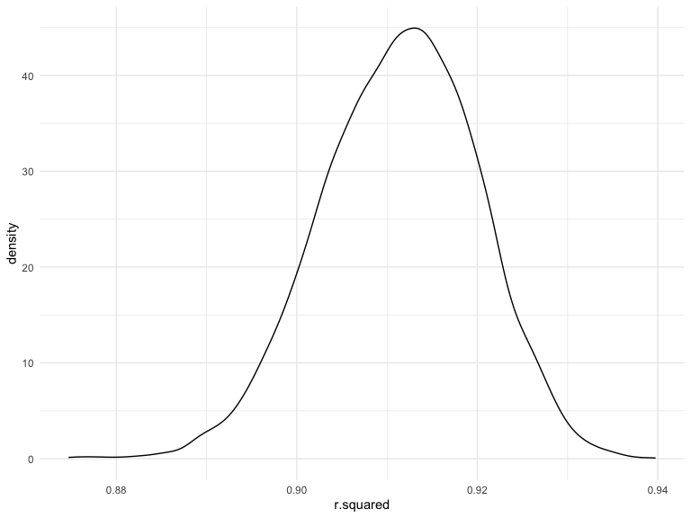
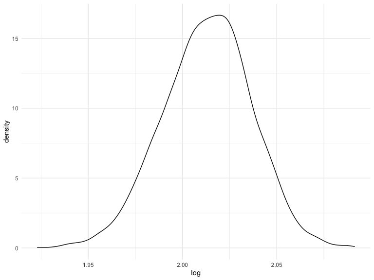

Homework 6
================
Michelle Lui
2020-12-09

``` r
library(tidyverse)
library(modelr)
library(p8105.datasets)
library(mgcv)
```

    ## Loading required package: nlme

    ## 
    ## Attaching package: 'nlme'

    ## The following object is masked from 'package:dplyr':
    ## 
    ##     collapse

    ## This is mgcv 1.8-33. For overview type 'help("mgcv-package")'.

### Problem 1

``` r
homicide_df = 
  read_csv("data/homicide-data.csv", na = c("", "NA", "Unknown")) %>% 
  mutate(
    city_state = str_c(city, state, sep = ", "),
    victim_age = as.numeric(victim_age),
    resolution = case_when(
      disposition == "Closed without arrest" ~ 0,
      disposition == "Open/No arrest"        ~ 0,
      disposition == "Closed by arrest"      ~ 1)
  ) %>% 
  filter(
    victim_race %in% c("White", "Black"),
    city_state != "Tulsa, AL") %>% 
  select(city_state, resolution, victim_age, victim_race, victim_sex)
```

    ## Parsed with column specification:
    ## cols(
    ##   uid = col_character(),
    ##   reported_date = col_double(),
    ##   victim_last = col_character(),
    ##   victim_first = col_character(),
    ##   victim_race = col_character(),
    ##   victim_age = col_double(),
    ##   victim_sex = col_character(),
    ##   city = col_character(),
    ##   state = col_character(),
    ##   lat = col_double(),
    ##   lon = col_double(),
    ##   disposition = col_character()
    ## )

One city

``` r
baltimore_df =
  homicide_df %>% 
  filter(city_state == "Baltimore, MD")
glm(resolution ~ victim_age + victim_race + victim_sex, 
    data = baltimore_df,
    family = binomial()) %>% 
  broom::tidy() %>% 
  mutate(
    OR = exp(estimate),
    CI_lower = exp(estimate - 1.96 * std.error),
    CI_upper = exp(estimate + 1.96 * std.error)
  ) %>% 
  select(term, OR, starts_with("CI")) %>% 
  knitr::kable(digits = 3)
```

| term              |    OR | CI\_lower | CI\_upper |
| :---------------- | ----: | --------: | --------: |
| (Intercept)       | 1.363 |     0.975 |     1.907 |
| victim\_age       | 0.993 |     0.987 |     1.000 |
| victim\_raceWhite | 2.320 |     1.648 |     3.268 |
| victim\_sexMale   | 0.426 |     0.325 |     0.558 |

Across cities

``` r
models_results_df = 
  homicide_df %>% 
  nest(data = -city_state) %>% 
  mutate(
    models = 
      map(.x = data, ~glm(resolution ~ victim_age + victim_race + victim_sex, data = .x, family = binomial())),
    results = map(models, broom::tidy)
  ) %>% 
  select(city_state, results) %>% 
  unnest(results) %>% 
  mutate(
    OR = exp(estimate),
    CI_lower = exp(estimate - 1.96 * std.error),
    CI_upper = exp(estimate + 1.96 * std.error)
  ) %>% 
  select(city_state, term, OR, starts_with("CI"))
```

``` r
models_results_df %>% 
  filter(term == "victim_sexMale") %>% 
  mutate(city_state = fct_reorder(city_state, OR)) %>% 
  ggplot(aes(x = city_state, y = OR)) + 
  geom_point() + 
  geom_errorbar(aes(ymin = CI_lower, ymax = CI_upper)) + 
  theme(axis.text.x = element_text(angle = 90, hjust = 1))
```


As the estimated ORs increase, so does the confidence interval that
corresponds to that OR.

### Problem 2

Read in and clean data

``` r
baby_df = 
  read_csv("./data/birthweight.csv") %>%
  mutate(
    babysex = as.factor(babysex),
    frace = as.factor(frace),
    malform = as.factor(malform),
    mrace = as.factor(mrace)
  ) %>%
  na.omit()
```

    ## Parsed with column specification:
    ## cols(
    ##   .default = col_double()
    ## )

    ## See spec(...) for full column specifications.

Plot data: birth weight vs birth length

``` r
baby_df %>%
  ggplot(aes(x = blength, y = bwt)) +
  geom_point(alpha = .5)
```


I wanted to plot baby’s length at birth against baby’s birth weight
because length was in both of the given models. We see from the graph
that there seems to be a relatively linear relationship between birth
length and birth weight, hence I will choose to leave it in my proposed
model.

Create proposed model

``` r
my_mod = lm(bwt ~ delwt * wtgain + gaweeks + blength, data = baby_df)
my_mod %>%
  broom::tidy()
```

    ## # A tibble: 6 x 5
    ##   term           estimate std.error statistic  p.value
    ##   <chr>             <dbl>     <dbl>     <dbl>    <dbl>
    ## 1 (Intercept)  -4481.      106.        -42.3  0.      
    ## 2 delwt            2.91      0.407       7.16 9.67e-13
    ## 3 wtgain           7.99      2.26        3.54 4.03e- 4
    ## 4 gaweeks         25.3       1.69       14.9  2.93e-49
    ## 5 blength        123.        2.00       61.3  0.      
    ## 6 delwt:wtgain    -0.0326    0.0138     -2.37 1.78e- 2

I created my model based on a hypothesized structure for the factors
that underly birth weight. I decided which variables to leave in the
model based off of whether or not their estimates were significant when
I used broom::tidy. For example, I had originally included malform, but
it ended up not being significant (had a p-value greater than 0.05), so
I took it out of my model. The predictors I included were the
interaction between delwt and wtgain and their main effects, ga weeks,
and blength.

Plot of model residuals against fitted values

``` r
baby_df %>%
  add_predictions(my_mod) %>%
  add_residuals(my_mod) %>%
  ggplot(aes(x = pred, y = resid)) + geom_point()
```


For the plot of model residuals against fitted values, we see that the
residuals mostly center around 0, however at the extreme values we see
very large residuals in both the positive and negative direction,
showing that this model may not be the best fit for either end of the
data, but works for the center of the data.

Cross validation for all three comparison models

``` r
cv_df = crossv_mc(baby_df, 100)
cv_df = 
  cv_df  %>%
  mutate(
    twovar_mod = map(train, ~lm(bwt ~ blength + gaweeks, data = .x)),
    threevar_mod = map(train, ~lm(bwt ~ bhead * blength * babysex, data = .x)),
    my_mod = map(train, ~lm(bwt ~ delwt * wtgain + gaweeks + blength, data = .x))) %>%
  mutate(
    rmse_twovar = map2_dbl(twovar_mod, test, ~rmse(model = .x, data = .y)),
    rmse_threevar = map2_dbl(threevar_mod, test, ~rmse(model = .x, data = .y)),
    rmse_myvar = map2_dbl(my_mod, test, ~rmse(model = .x, data = .y)))
```

plot prediction error distribution

``` r
cv_df %>% 
  select(starts_with("rmse")) %>% 
  pivot_longer(
    everything(),
    names_to = "model", 
    values_to = "rmse",
    names_prefix = "rmse_") %>% 
  mutate(model = fct_inorder(model)) %>% 
  ggplot(aes(x = model, y = rmse)) + geom_violin()
```


When comparing the violin plots for the cross validated prediction
error, we get a sense of variance in prediction error and we can compare
the prediction error distributions across the different models. It seems
that the three way interaction model is the best fit since it has the
lowest RMSE, while my model seems slightly better than the birth and
gestational age model, but still worse than the three way interaction
model.

### Problem 3

Read in and clean data

``` r
weather_df = 
  rnoaa::meteo_pull_monitors(
    c("USW00094728"),
    var = c("PRCP", "TMIN", "TMAX"), 
    date_min = "2017-01-01",
    date_max = "2017-12-31") %>%
  mutate(
    name = recode(id, USW00094728 = "CentralPark_NY"),
    tmin = tmin / 10,
    tmax = tmax / 10) %>%
  select(name, id, everything())
```

    ## Registered S3 method overwritten by 'hoardr':
    ##   method           from
    ##   print.cache_info httr

    ## using cached file: /Users/michellelui/Library/Caches/R/noaa_ghcnd/USW00094728.dly

    ## date created (size, mb): 2020-12-09 14:13:10 (7.536)

    ## file min/max dates: 1869-01-01 / 2020-12-31

Look at parameters for proposed model

``` r
lm(tmax ~ tmin, data = weather_df) %>%
  broom::tidy() %>%
  knitr::kable(digits = 3)
```

| term        | estimate | std.error | statistic | p.value |
| :---------- | -------: | --------: | --------: | ------: |
| (Intercept) |    7.209 |     0.226 |    31.847 |       0 |
| tmin        |    1.039 |     0.017 |    61.161 |       0 |

``` r
lm(tmax ~ tmin, data = weather_df) %>%
  broom::glance() %>%
  knitr::kable(digits = 3)
```

| r.squared | adj.r.squared | sigma | statistic | p.value | df |    logLik |      AIC |      BIC | deviance | df.residual | nobs |
| --------: | ------------: | ----: | --------: | ------: | -: | --------: | -------: | -------: | -------: | ----------: | ---: |
|     0.912 |         0.911 | 2.938 |  3740.663 |       0 |  1 | \-910.286 | 1826.572 | 1838.272 | 3133.449 |         363 |  365 |

\*Bootstrap for R squared

produce data frame with estimates

``` r
bootstrap_rsquared = 
  weather_df %>%
  modelr::bootstrap(n = 5000) %>%
  mutate(
    models = map(strap, ~lm(tmax ~ tmin, data = .x) ),
    results = map(models, broom::glance)) %>% 
  select(-strap, -models) %>% 
  unnest(results) 
```

Plot distribution of R squared estimates

``` r
bootstrap_rsquared %>%
  ggplot(aes(x = r.squared)) +
  geom_density()
```


The distribution of the r-squared estimates have a mostly normal
distribution that is centered around 0.91, although it is slightly left
skewed.

Get 95% confidence interval of R squared

``` r
bootstrap_rsquared %>%
  summarize(
    ci_lower = quantile(r.squared, 0.025),
    ci_upper = quantile(r.squared, 0.975))
```

    ## # A tibble: 1 x 2
    ##   ci_lower ci_upper
    ##      <dbl>    <dbl>
    ## 1    0.894    0.927

The 95% confidence interval for r-squared is 0.8947 to 0.9266. We are
95% confidence that the true R-squared value lies between 0.8947 and
0.9266.

*Bootstrap for log(b0 * b1)

produce data frame with estimates

``` r
bootstrap_log = 
  weather_df %>%
  modelr::bootstrap(n = 5000) %>%
  mutate(
    models = map(strap, ~lm(tmax ~ tmin, data = .x) ),
    results = map(models, broom::tidy)) %>% 
  select(-strap, -models) %>% 
  unnest(results) %>%
  select(.id, term, estimate) %>%
  pivot_wider(
    names_from = "term",
    values_from = "estimate"
  )

bootstrap_log =
tibble(
bootstrap_log,
log = log(pull(bootstrap_log, '(Intercept)') * pull(bootstrap_log, tmin)))
```

Plot distribution of log(b0\*b1) estimates

``` r
bootstrap_log %>%
  ggplot(aes(x = log)) +
  geom_density()
```


The distribution for the estimates of log(b0\*b1) look like a normal
distribution centered around 2.02, with a little bit of a left skew.

95% confidence interval of log(b0\*b1)

``` r
bootstrap_log %>%
  summarize(
    ci_lower = quantile(log, 0.025),
    ci_upper = quantile(log, 0.975))
```

    ## # A tibble: 1 x 2
    ##   ci_lower ci_upper
    ##      <dbl>    <dbl>
    ## 1     1.97     2.06

The 95% confidence interval for log(b0*b1) is 1.9652 to 2.0580. We are
95% confident that the true value of log(b0*b1) is between 1.9652 and
2.0580.
